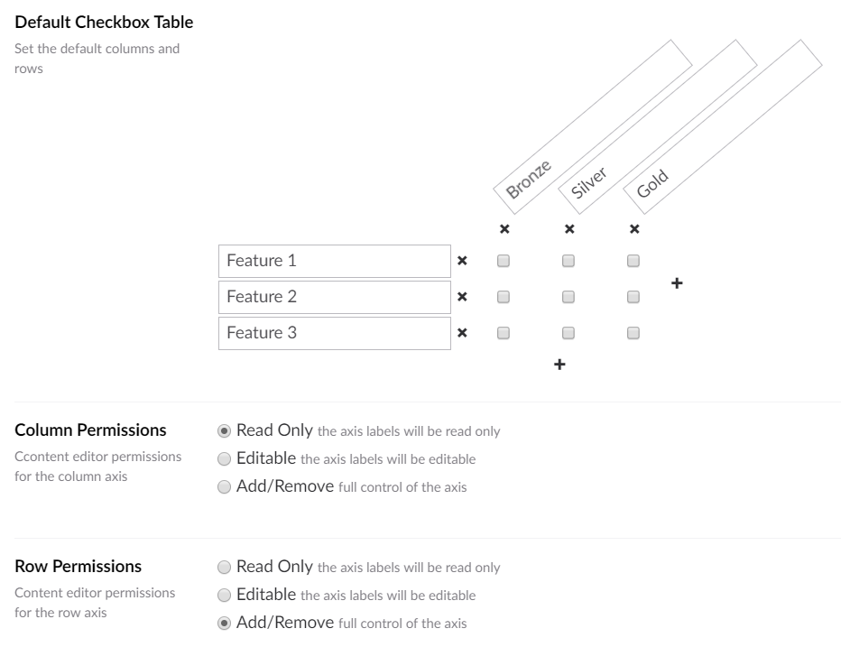

# Umbraco Checkbox Table
Property editor (and value converter) for a table with row / column text and checkbox cells

## Property Editor

    
## Property Editor Configuration

## Model Rendering

The built in property-value-converter will return a strongly typed model of type: Our.Umbraco.CheckboxTable.Models.CheckboxTable

    <table>
        <tr>
            <th></th>
            @foreach (var columnLabel in checkboxTable.ColumnLabels)
            {
                <th>@columnLabel</th>
            }
        </tr>
        @foreach (var row in checkboxTable.Rows)
        {
            <tr>
                <td>@row.RowLabel</td>
                @foreach (var cell in row.Cells)
                {
                    <td>@(cell ? "X" : "")</td>
                }
            </tr>
        }
    </table>